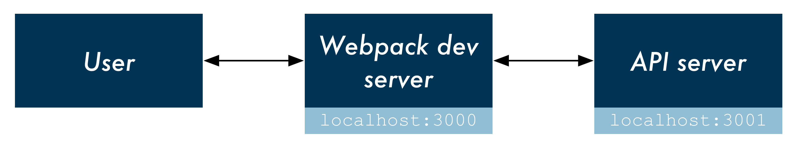

# `create-react-app` with a server example

 [](https://www.fullstackreact.com)

This project demonstrates using the setup generated by `create-react-app` alongside a Node Express API server.

### Detailed blog post

We have a [detailed blog post](https://www.fullstackreact.com/articles/using-create-react-app-with-a-server/) that explains this repository.

### Rails

Check out the [Rails version](https://github.com/fullstackreact/food-lookup-demo-rails) if that's your preferred API server platform.

## Running

```
git clone git@github.com:fullstackreact/food-lookup-demo.git
cd food-lookup-demo
npm i

cd client
npm i

cd ..
npm start
```

## Overview

`create-react-app` configures a Webpack development server to run on `localhost:3000`. This development server will bundle all static assets located under `client/src/`. All requests to `localhost:3000` will serve `client/index.html` which will include Webpack's `bundle.js`.

To prevent any issues with CORS, the user and her browser will communicate exclusively with the Webpack development server.

Inside `Client.js`, we use Fetch to make a request to the API:

```js
// Inside Client.js
return fetch(`/api/food?q=${query}`, {
  // ...
})
```

This request is made to `localhost:3000`, the Webpack dev server. Because the route has the special prefix `/api/`, the Webpack server knows that this request is actually intended for our API server. We specify in `package.json` that we would like Webpack to proxy API requests to `localhost:3001`:

```js
// Inside client/package.json
"proxy": "http://localhost:3001/",
```

This handy features is provided for us by `create-react-app`.

Therefore, the user's browser makes a request to Webpack at `localhost:3000` which then proxies the request to our API server at `localhost:3001`:



This setup provides two advantages:

1. If the user's browser tried to request `localhost:3001` directly, we'd run into issues with CORS.
2. In many setups, this means that references to the API URL in development matches that in production. You don't have to do something like this:

```js
// Example API base URL determination in Client.js
const apiBaseUrl = process.env.NODE_ENV === 'development' ? 'localhost:3001' : '/'
```

This setup uses [node-foreman](https://github.com/strongloop/node-foreman) for process management. Executing `npm start` instructs Foreman to boot both the Webpack dev server and the API server.
